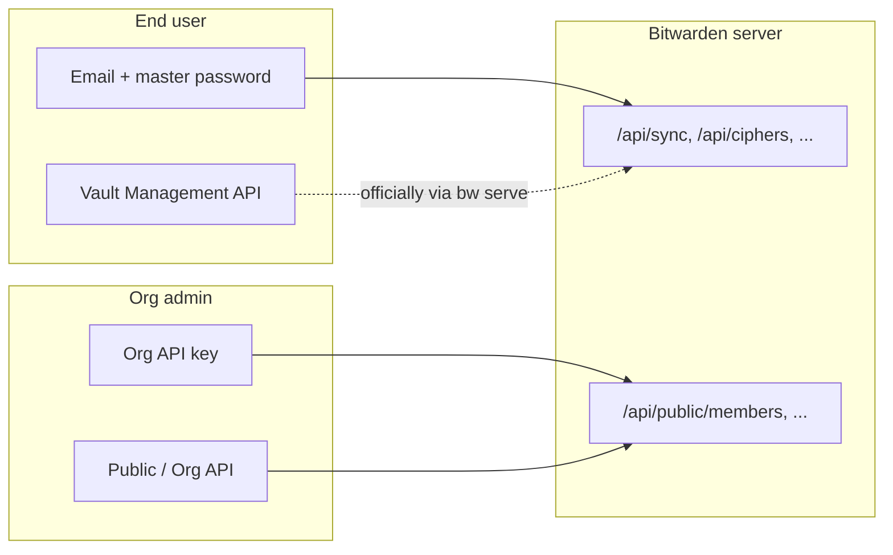

# Bitwarden API overview

Reference for the two OpenAPI specs in this folder and how they relate to this project.

| File | API | Audience |
|------|-----|----------|
| [`api.json`](./api.json) | Public / Organisation Management API | Organisation **admins** |
| [`vault-management-api.json`](./vault-management-api.json) | Vault Management API | **End users** managing their vault |

These specs point at each other: org admin docs link to the vault API, and the vault API links to the org API.

---

## `api.json` — Public / Organisation Management API

**Purpose:** Admin operations on a Bitwarden **organisation** — not for end users unlocking a personal vault.

**Official docs:** [bitwarden.com/help/api](https://bitwarden.com/help/api/)

### What it covers

| Area | Routes | Purpose |
|------|--------|---------|
| **Members** | `/public/members`, reinvite, revoke, restore | Add, update, remove org members |
| **Collections** | `/public/collections` | Manage shared password collections |
| **Groups** | `/public/groups`, `/member-ids` | Group users and tie them to collections |
| **Events** | `/public/events` | Audit log / activity history |
| **Policies** | `/public/policies` | Org security policies (e.g. 2FA required) |
| **Organisation** | `/public/organization/subscription`, `/import` | Subscription info, bulk import |

### Where it runs

On the remote Bitwarden server:

- **US:** `https://api.bitwarden.com/public/...`
- **EU:** `https://api.bitwarden.eu/public/...`
- **Self-hosted:** `https://your-server/api/public/...`

### Authentication

OAuth2 **client credentials** using an organisation **API key** from Organisation Settings:

- `client_id` + `client_secret`
- Scope: `api.organization`
- Token URL: `{identityUrl}/connect/token`

This is **separate** from user login (email + master password).

### Mental model

**“IT/admin API”** — automate running an organisation’s Bitwarden instance.

### In this project

Implemented as Nitro adapter routes under **`/api/org/*`**, proxying to `/api/public/*` on the selected server. See [`docs/architecture.md`](../docs/architecture.md).

---

## `vault-management-api.json` — Vault Management API

**Purpose:** Day-to-day vault work for a **logged-in user** — personal vault and org items they can access.

**Official docs:** [bitwarden.com/help/vault-management-api](https://bitwarden.com/help/vault-management-api/)

### What it covers

| Area | Routes | Purpose |
|------|--------|---------|
| **Lock / unlock** | `/lock`, `/unlock` | Lock vault or unlock with master password |
| **Items (ciphers)** | `/object/item`, `/list/object/items` | CRUD for logins, cards, notes, identities |
| **Field getters** | `/object/password/{id}`, `/username/{id}`, `/uri/{id}`, `/totp/{id}`, etc. | Read specific fields from an item |
| **Folders** | `/object/folder`, `/list/object/folders` | Organise items in folders |
| **Attachments** | `/attachment`, `/object/attachment/{id}` | File attachments on items |
| **Sends** | `/object/send`, `/send/list` | Bitwarden Send (secure sharing links) |
| **Org vault** | `/move/{itemid}/{orgId}`, org collections, device approval | Move items to org, manage org collections, approve devices |
| **Utilities** | `/sync`, `/status`, `/generate`, `/object/fingerprint/me` | Sync vault, CLI status, password generator, fingerprint phrase |

### Where it runs (officially)

Locally via Bitwarden CLI:

```bash
bw serve   # typically http://localhost:8087
```

The CLI holds the unlocked session and exposes this REST API.

### Authentication

Assumes the CLI is already **logged in and unlocked**. No separate OAuth flow in the spec.

### Response shape

Most endpoints return:

```json
{
  "success": true,
  "data": { ... }
}
```

### Mental model

**“User vault API”** — browse, sync, copy passwords, manage items, folders, and sends.

### In this project

Implemented as Nitro adapter routes under **`/api/vault/*`** with the same `{ success, data }` contract. The server proxies to Bitwarden client REST (`/api/sync`, `/api/ciphers`, etc.). Crypto stays in the browser — this app does **not** require `bw serve`.

See [`docs/architecture.md`](../docs/architecture.md).

---

## How they compare

| | **Vault Management API** | **Public / Org API** |
|---|---|---|
| **Spec file** | `vault-management-api.json` | `api.json` |
| **User** | Vault owner | Org administrator |
| **Goal** | Use my passwords | Manage my organisation |
| **Auth** | Unlocked CLI session (official) | Org API key (client credentials) |
| **Scope** | Items, folders, sync, sends | Members, groups, collections, policies, events |
| **Project adapter** | `/api/vault/*` | `/api/org/*` |

---

## Third path: Bitwarden client REST API (login & sync)

Neither spec fully documents the flow the **official web/desktop apps** use. This project also uses that transport directly for authentication:

| Step | Endpoint | Purpose |
|------|----------|---------|
| Prelogin | `POST {apiUrl}/accounts/prelogin` | KDF parameters |
| Login | `POST {identityUrl}/connect/token` | Access + refresh tokens |
| Sync | `GET {apiUrl}/sync` | Full vault snapshot (encrypted) |

Server URLs (US / EU / self-hosted) are resolved in [`shared/utils/servers.ts`](../shared/utils/servers.ts).



---

## Related files in `.context`

- [`bitwarden-brand-colors.md`](./bitwarden-brand-colors.md) — brand palette for UI theming
- [`api.json`](./api.json) — full OpenAPI spec (org admin)
- [`vault-management-api.json`](./vault-management-api.json) — full OpenAPI spec (user vault)
