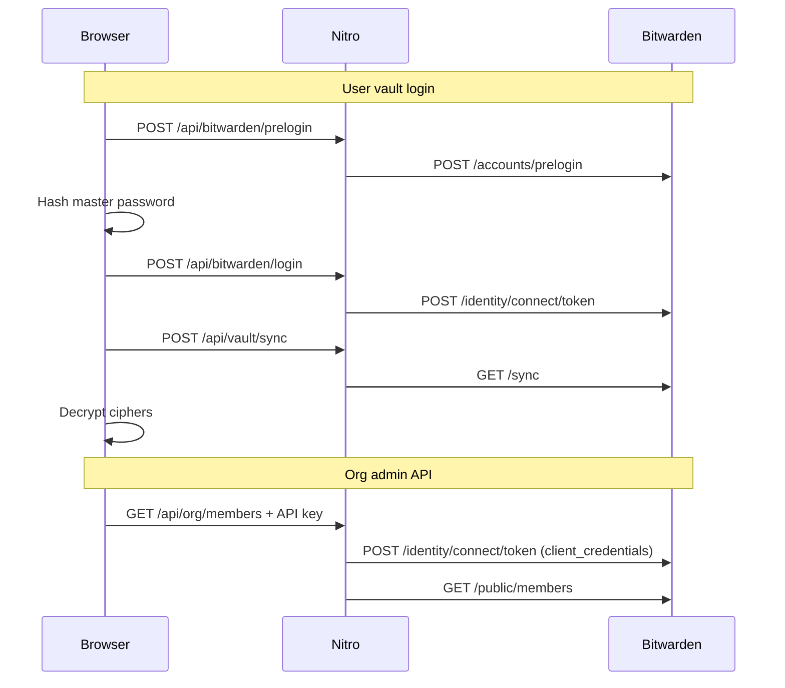

# Vault — architecture

Remote Bitwarden web client that connects to US, EU, or self-hosted servers — similar to the desktop app, without requiring `bw serve` or the Bitwarden CLI.

## Transport layer

The app uses the **Bitwarden client REST API** (same as official clients):

| Step | Endpoint | Purpose |
|------|----------|---------|
| Prelogin | `POST {apiUrl}/accounts/prelogin` | KDF parameters |
| Login | `POST {identityUrl}/connect/token` | Access + refresh tokens |
| Sync | `GET {apiUrl}/sync` | Vault snapshot (encrypted) |

Server URLs are resolved by [`shared/utils/servers.ts`](../shared/utils/servers.ts):

- **US:** `api.bitwarden.com` / `identity.bitwarden.com`
- **EU:** `api.bitwarden.eu` / `identity.bitwarden.eu`
- **Self-hosted:** `{base}/api` and `{base}/identity`

Self-host inputs are normalised (strip trailing `/api`, `/identity`, add `https://`).

## Adapter layers

Two OpenAPI specs are implemented as Nitro adapters (not as local CLI proxies):

### Vault Management API → `/api/vault/*`

Mimics the `bw serve` contract (`{ success, data }` responses). Proxies to Bitwarden client REST.

| Vault route | Bitwarden backend |
|-------------|-------------------|
| `POST /sync` | `GET /sync` |
| `GET /list/object/items` | `GET /sync` (filtered ciphers) |
| `GET /list/object/folders` | `GET /sync` (folders) |
| `GET /object/{field}/{id}` | `GET /ciphers/{id}` |
| `POST /object/item` | `POST /ciphers` |
| `PUT /object/item/{id}` | `PUT /ciphers/{id}` |
| `DELETE /object/item/{id}` | `DELETE /ciphers/{id}` |
| Folder CRUD | `/folders` |
| `GET /generate` | Local password generator |
| `POST /lock` | Client session clear |
| `GET /status` | Session metadata |

**Crypto:** Master key and decryption stay in the browser ([`app/utils/crypto.ts`](../app/utils/crypto.ts)). The server never sees the master password or decrypted secrets.

### Public / Org API → `/api/org/*`

Proxies `/public/*` routes for organisation administration.

| Org route | Bitwarden backend |
|-----------|-------------------|
| `/api/org/members` | `/public/members` |
| `/api/org/collections` | `/public/collections` |
| `/api/org/groups` | `/public/groups` |
| `/api/org/events` | `/public/events` |
| `/api/org/policies` | `/public/policies` |

**Auth:** OAuth2 client credentials (`client_id` + `client_secret` from org Settings → API Key), scope `api.organization`. Separate from user vault login.

## Auth flows



## Self-hosted TLS

For self-signed certificates during local development, set:

```bash
BITWARDEN_ALLOW_INSECURE_TLS=true
```

Use `GET /api/bitwarden/health?preset=self&selfHostUrl=...` to test connectivity before login.

## Key files

| Area | Path |
|------|------|
| Server URL resolution | `shared/utils/servers.ts` |
| Fetch + TLS | `server/utils/bitwarden.ts` |
| Route registry | `server/services/bitwarden/registry.ts` |
| Vault adapter | `server/api/vault/**` |
| Org adapter | `server/api/org/[...path].ts` |
| User auth composable | `app/composables/useBitwardenAuth.ts` |
| Vault composable | `app/composables/useVaultContext.ts` |
| Vault API composable | `app/composables/useVaultApi.ts` |
| Org API composable | `app/composables/useOrgApi.ts` |
